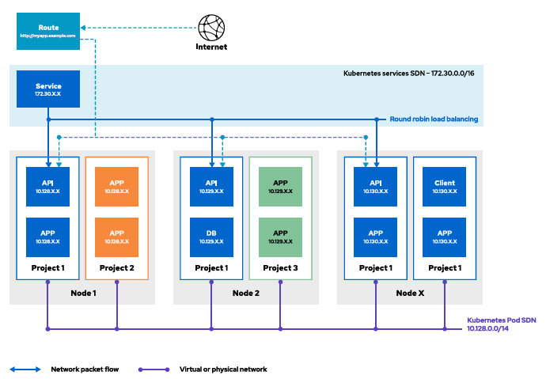

# Chapter4. Network Security

## 4-2. Configure Network Policies

### TLS 로 외부 트래픽 보호

노드끼리의 통신은 암호화를 하지만 컨테이너간 통신을 할때는 기본적으로 암호화를 하지 않는다.  
하지만 보안을 강화하기 위해서 service mesh같은 것들을 쓰면, 암호화 가능하다.  
하지만 좀 복잡하므로, 자체적으로 서비스 인증서를 발급할수도있다.  

### 외부 트래픽 처리 흐름

트래픽이 Route -> Service -> Pod 순서로 흐름.



1. 외부 트래픽 유입 (Internet → Route)  
   인터넷에서 들어온 요청이 가장 먼저 Route(http://myapp.example.com)에 도착
2. Route에서 Service로 전달 (Route → Service)
   Route는 트래픽을 클러스터 내부의 Service(172.30.X.X)로 전달
3. Service에서 Pod로 분산 (Service → Pods)
   Service는 연결된 여러 개의 API/APP Pod(10.128.X.X 등)로 부하를 분산
   Service가 Selector와 Pod의 Label이 일치하는 Pod를 찾아감.

### **[troubel shooting]** : endpoint 가 없어서 외부에서 URL로 서비스 접근 불가능

Route와 Service는 있는데, Service에서 Pod로 가는 화살표(Endpoints)가 없었음.  
Service 의 Selector는 name 값을 가지고 pod의 label을 찾는다.
그런데, Service의 selector가 name: todo-http인데, 실제 실행 중인 Pod에는 그 꼬리표(Label)가 없어서 Service가 트래픽을 전달할 Pod를 하나도 찾지 못함.


#### 핵심 원인
Service의 Selector와 Pod의 Label 키/값 쌍이 서로 일치하지 않아 논리적 연결(Endpoints)이 생성되지 않음.


#### 해결법

service 의 selector.name과 pod의 label을 동일하게 맞춰주기 위해서  
DeploymentConfig(또는 Deployment)의 spec.template.metadata.labels에 Service가 찾고 있는 name: todo-http 라벨을 추가함.

```bash
kind: DeploymentConfig # 또는 Deployment
metadata:
  name: todo-http
spec:
  template: # <--- 여기서부터 Pod 설계도 시작
    metadata:
      labels: # <--- 여기서 Pod의 라벨을 정의
        app: todo-http
        name: todo-http # <--- Service의 Selector와 일치하도록 이 줄을 추가!
```

YAML 수정 후, 기존 Pod는 삭제되고 새로운 라벨을 가진 Pod가 자동으로 생성(Rolling Update)되어 서비스에 즉시 투입된다


서비스와 pod의 엔드포인트(service -> pod)는 아래 명령어로 확인할 수 있다.


```bash
# 특정 서비스의 엔드포인트만 확인
oc get endpoints todo-http

# 서비스가 현재 어떤 라벨을 찾고 있는지(Selector) 확인
oc get svc todo-http -o jsonpath='{.spec.selector}'

# 현재 실행 중인 Pod들이 어떤 라벨을 가지고 있는지 확인
oc get pods --show-labels

# 기존 Pod가 Terminating 되고 새 Pod가 Running 되는지 확인
oc get pods 
```
